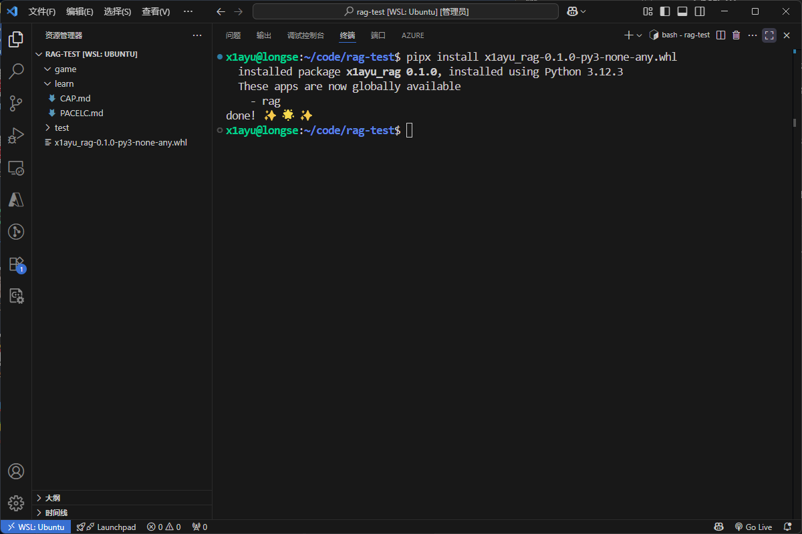
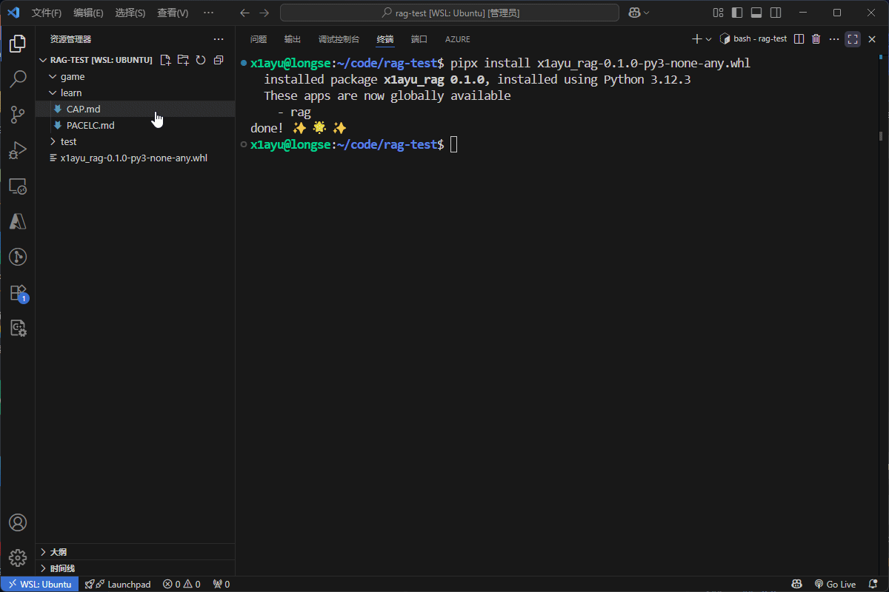
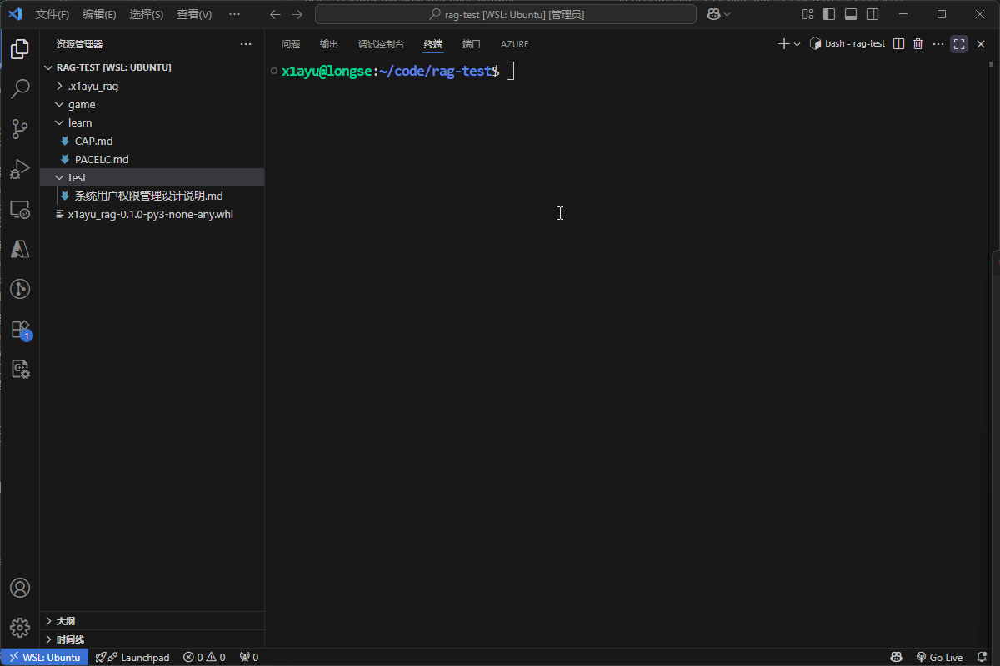
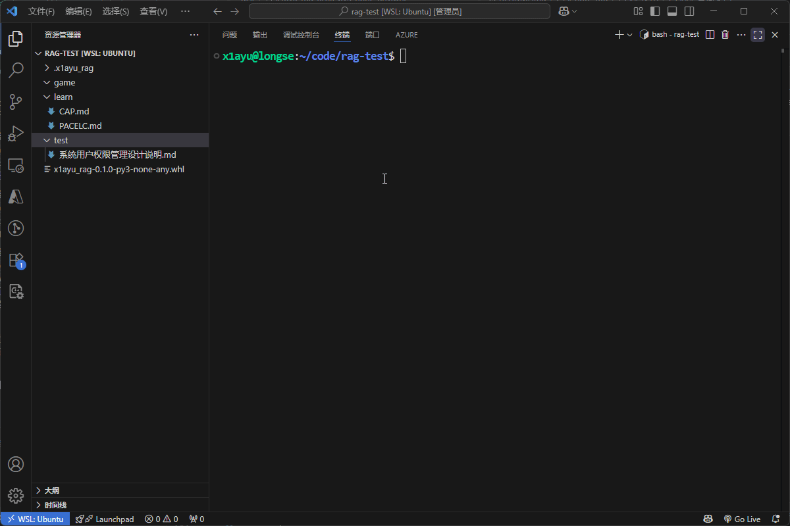
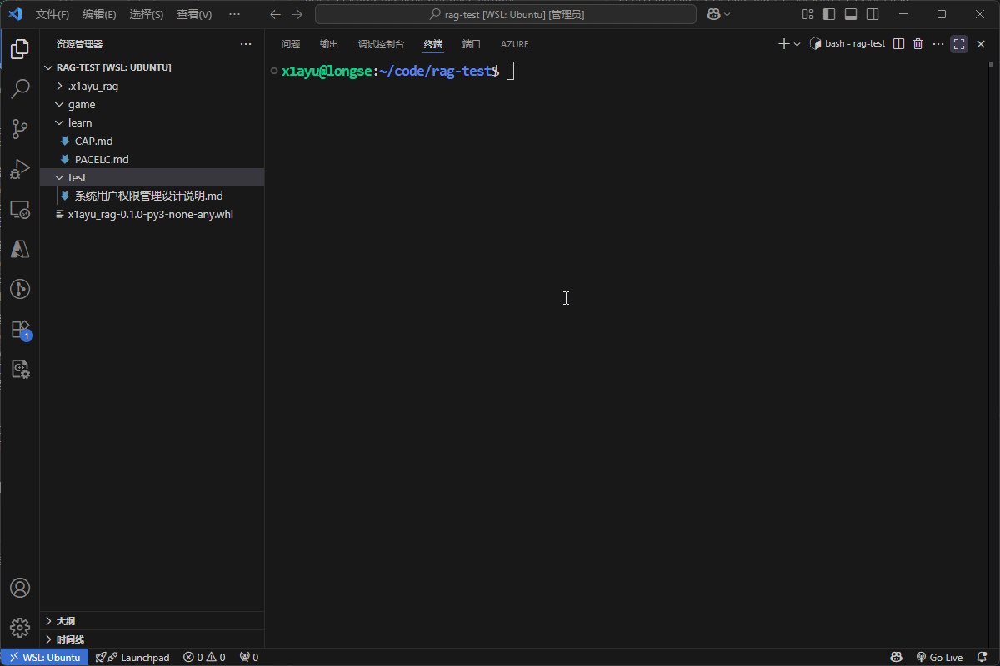
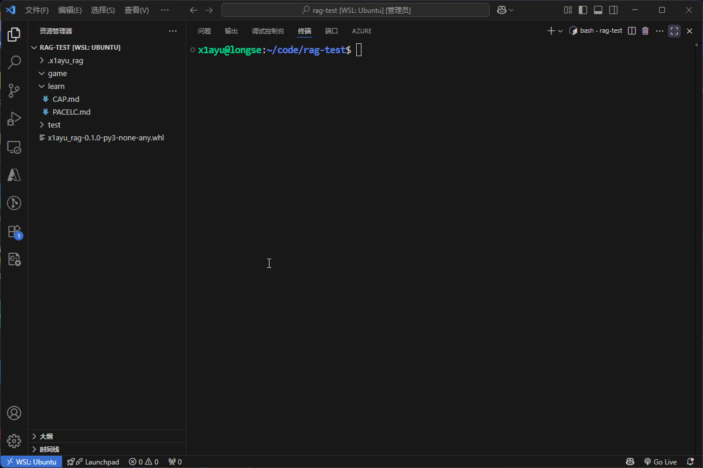
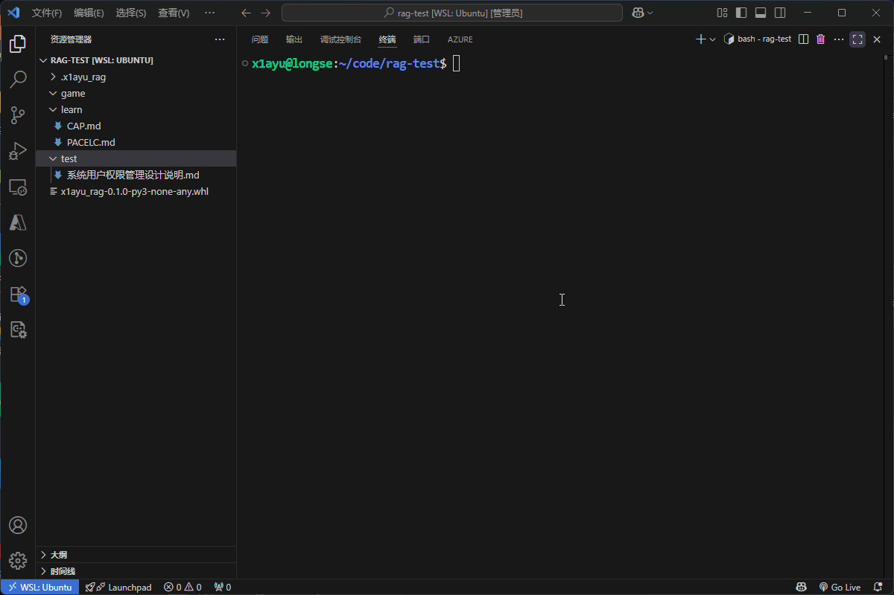

# note_rag
基于langChain+Ollama+Milvus+sqlite实现的本地个人笔记rag系统
## 使用
### 打包
```bash
uv build
```
### 安装
将打包好的 `x1ayu_rag-0.1.0-py3-none-any.whl` 安装到系统中
```bash
pipx install x1ayu_rag-0.1.0-py3-none-any.whl
```

### 初始化与配置
```bash
rag init
```

### 添加文档
```bash
rag add . # 添加当前目录下的所有文档
rag add test.md # 添加 test.md 文件
```
### 查看文档列表
```bash
rag show
```

### 查询文档
```bash
rag select "如何设计权限系统"
```

### 问答
```bash
rag chain "如何设计权限系统"
```

## 对比
使用小模型更能对比出rag的效果
### 无rag

### 有rag


## 模型支持
- ollama
- openai

## 项目结构
